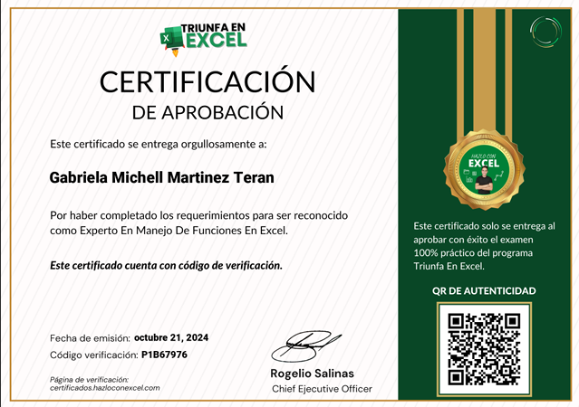
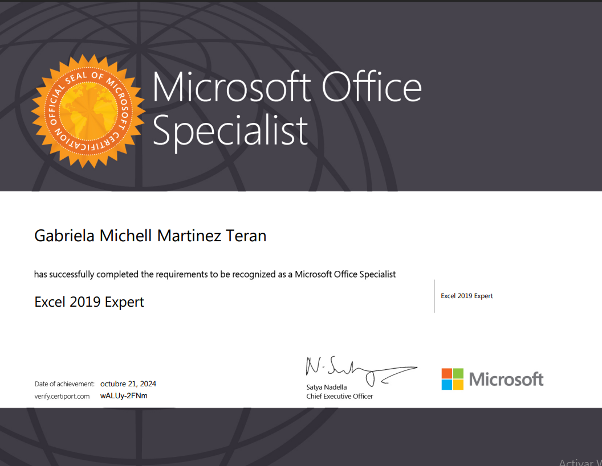

## Hola, Saludos👋
# 👩‍💻 Gabriela Martinez

¡Hola! Soy **Ingeniera en Sistemas** apasionada por la tecnología y el aprendizaje continuo.  
Actualmente me especializo en **Análisis de Datos Junior**, con experiencia en **Excel** y herramientas de **Office**.  

---

## 🚀 Especialidades
- 📊 Análisis de datos (nivel junior)  
- 📈 Manejo avanzado de Excel (tablas dinámicas, gráficos, Macros, fórmulas, entre otros.)  
- 🛠️ Herramientas Office (Word, PowerPoint, Access)  

---

## 📜 Certificados
Aquí puedes encontrar mis certificaciones y logros:  
- [Certificado de Excel](#)  

  

- [Certificado de Microsoft Office Specialist](#)

---

## 🌐 Conecta conmigo
- 💼 [LinkedIn](https://www.linkedin.com/in/gabriela-martinez-teran/)  
- 📧 gabbymrtnz292@gmail.com 

---

✨ *Mi objetivo es crecer en el área de análisis de datos y aportar soluciones prácticas basadas en información clara y confiable.*
